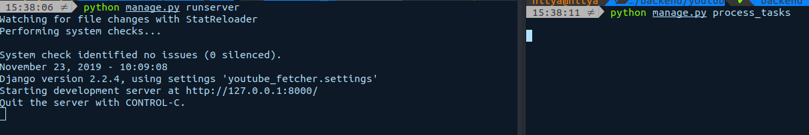
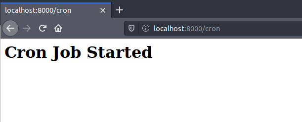
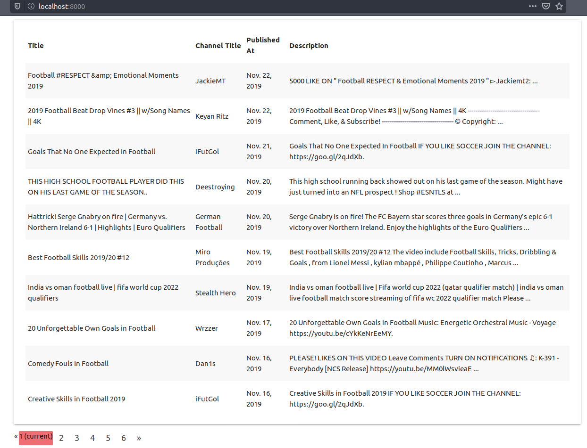

## Video Fetch Youtube

## RUN
* `pip install -r requirements.txt`
* ADD api key to `.bashrc` => `export YOUTUBE_KEY='your api key'`
* migrate `python manage.py migrate`
* start server `python manage.py runserver`
* create a admin `python manage.py createsuperuser`
* In a new terminal `python manage.py process_tasks`
    
    

* Visit `localhost:8000/cron` to start the cron process in background

    

* Visit `localhost:8080` to view the data

    